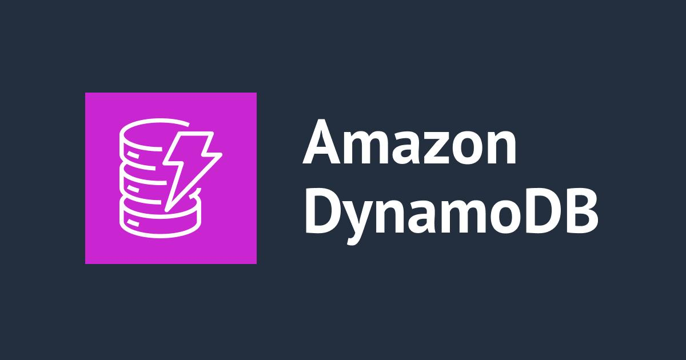
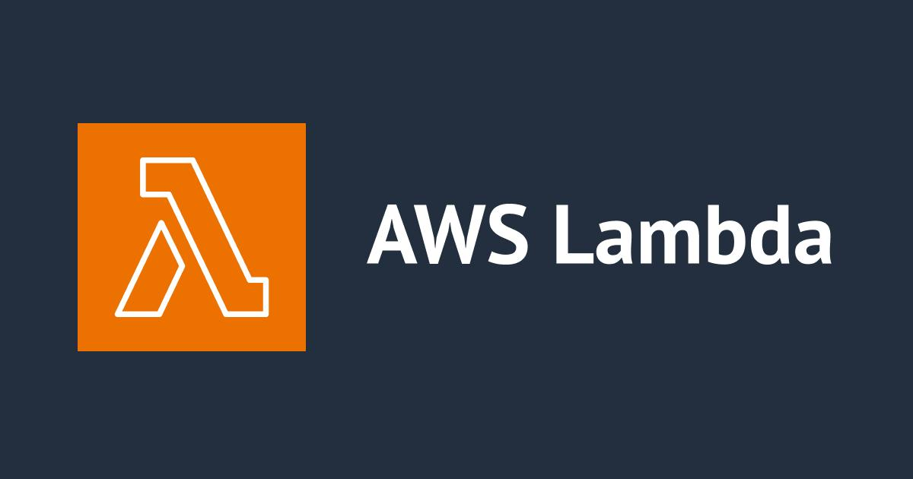

# Serverless To-Do App

A simple Serverless To-Do Application built using AWS services.

## AWS Services Used

- AWS Lambda
- API Gateway
- DynamoDB
- Amazon S3
- IAM

---

# Project Architecture


---

# Features

- Add Tasks
- View Tasks
- Serverless Backend
- Static Website Hosting
- Cloud Based Database

---

# Project Structure

```bash
serverless-todo-app/
│
├── index.html
├── style.css
├── script.js
├── README.md
└── images/
```

---

# Frontend

## Home Page


---

# API Testing


---

# DynamoDB Table



---

# Lambda Function



---

# S3 Hosting


---

# Deployment Steps

## 1. Create DynamoDB Table

Create table:

- Table Name: TodoTable
- Partition Key: taskId

---

## 2. Create Lambda Function

Runtime:

```python
Python 3.12
```

---

## 3. Create API Gateway

Methods:

- GET
- POST

---

## 4. Deploy Frontend to S3

Enable:

- Static Website Hosting

---

# Run Project

Open:

```bash
index.html
```

OR deploy to S3.

---

# Author

Sumit Kaulkar